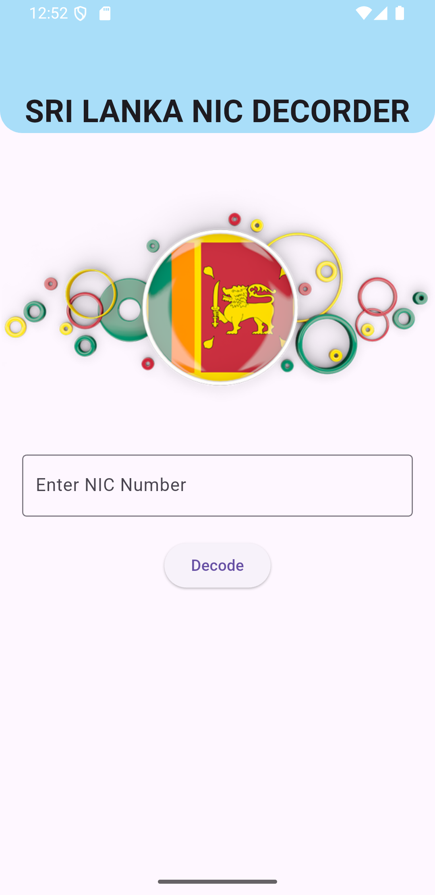
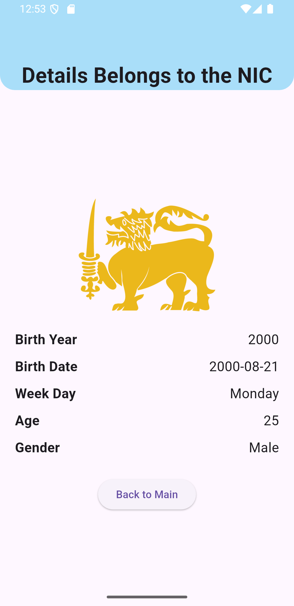

# NIC Decoder Application 🇱🇰

**NIC Decoder** is a Flutter-based mobile application that allows users to decode Sri Lanka’s National Identity Card (NIC) number and view personal details such as **gender**, **date of birth**, and more. This easy-to-use app helps automate the process of retrieving vital information from a NIC number.

---

## 🚀 Features

- **NIC Decoding:** Extracts gender, date of birth, and other details from a NIC number.
- **User-Friendly Interface:** Clean, simple, and intuitive UI/UX.
- **Cross-Platform:** Built with **Flutter**, ensuring compatibility with both Android and iOS.
- **Future Updates:** Firebase integration coming soon for enhanced features.

---

## 🛠 Installation

To get started with the NIC Decoder Application:

### 1️⃣ Clone the repository:
```bash
git clone https://github.com/pubudusanka/NIC_Decoder_Application.git
```
### 2️⃣ Install dependencies:
```bash
flutter pub get
```
### 3️⃣ Run the app:
```bash
flutter run
```
## 🔧 Technologies Used

- **Flutter** (Dart) for cross-platform development.
- **Firebase** (coming soon for data handling).
- **Material Design** for responsive UI components.

## 📸 Screenshots



## 🤝 Contributing

We welcome contributions from the community! If you'd like to contribute to this project:

1. Fork the repository.
2. Create a new branch.
3. Make your changes.
4. Submit a pull request.

## 📝 License

This project is licensed under the **MIT License**.

## 📬 Contact

For any questions or inquiries, feel free to reach out:
- Email: pubudusanka79@gmail.com
- GitHub: @pubudusanka